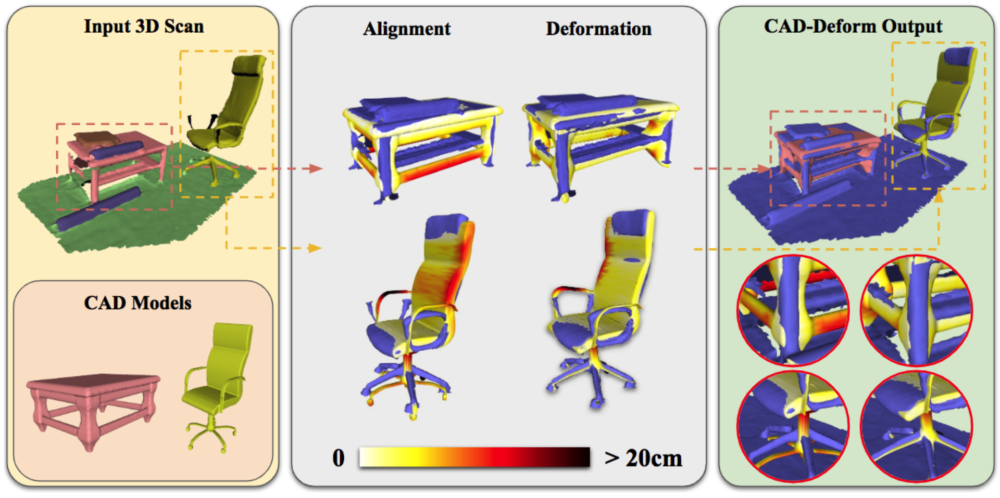
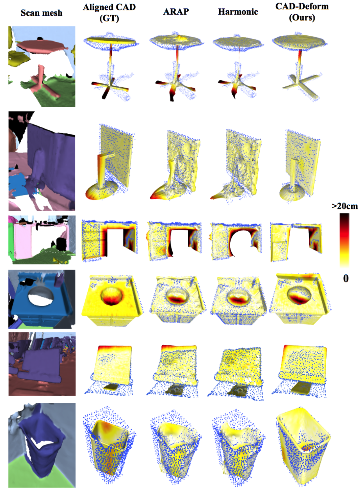

# CAD-Deform: Deformable Fitting of CAD Models to 3D Scans (ECCV 2020)

We present *CAD-Deform*, a novel data-driven mesh deformation framework that fits aligned 3D CAD models from a shape database to 3D scans.



[Download Paper (.pdf)](https://arxiv.org/pdf/2007.11965.pdf) 

## Demo samples



## Get started

The core of this repository is mesh deformation framework, it is possible to use it for any RGB-D data (point clouds). 
If you want to make inference for ScanNet dataset using ShapeNet/PartNet shape catalogues, please follow the steps below:

1. Clone repo: ```git clone https://github.com/alexeybokhovkin/CAD-Deform```

2. Download datasets: (you will need *ScanNet*, *ShapeNet*, *PartNet*).

3. Perform remeshing of ShapeNet models to 6-12k using [Watertight Manifold](https://github.com/hjwdzh/Manifold).

4. Make inference of any CAD model alignment method (for example, [Scan2CAD](https://github.com/skanti/Scan2CAD) or [End-to-end alignment](https://arxiv.org/abs/1906.04201)).

5. Extract exact (for NN data term) or fuzzy (for P2P data term) correspondences between ScanNet scans and aligned PartNet models using nearest-neighbor approach
using scripts ```scripts/align_shapes.py``` and ```scripts/prepare_deformation_input.py```. You also need to use metadata from ```dictionaries``` in ```shapefit/utils/pathnames.py```.

6. Perform the deformation inference (you can see the example in ```notebooks/deformation_inference.ipynb```).

## Citation

If you use this framework please cite:

```
@InProceedings{10.1007/978-3-030-58601-0_36,
author="Ishimtsev, Vladislav
and Bokhovkin, Alexey
and Artemov, Alexey
and Ignatyev, Savva
and Niessner, Matthias
and Zorin, Denis
and Burnaev, Evgeny",
title="CAD-Deform: Deformable Fitting of CAD Models to 3D Scans",
booktitle="Computer Vision -- ECCV 2020",
year="2020",
publisher="Springer International Publishing",
address="Cham",
pages="599--628",
isbn="978-3-030-58601-0"
}
```
